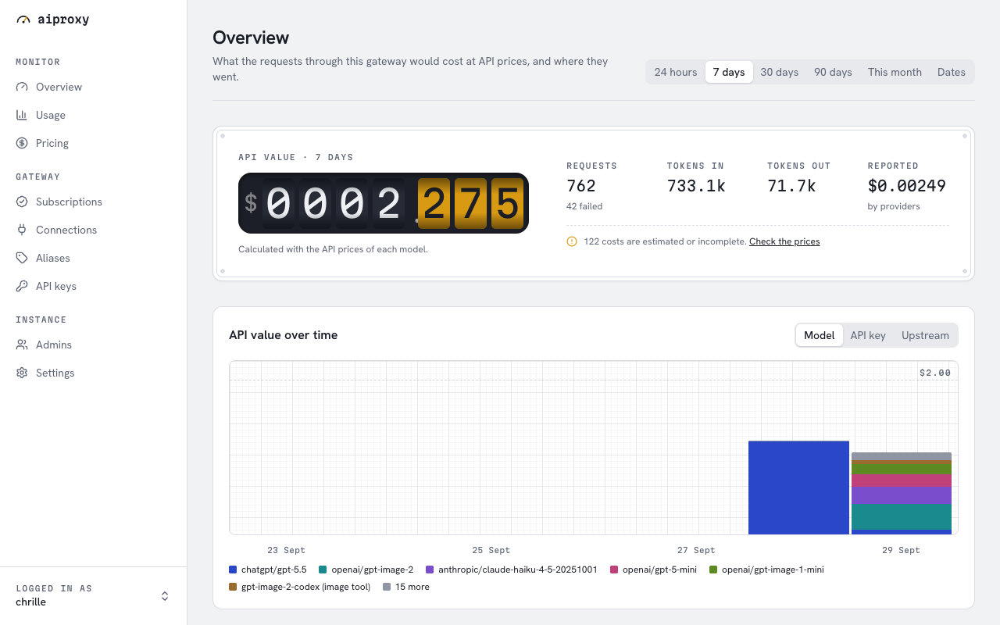

# aiproxy

A self-hosted gateway with OpenAI- and Claude Code-compatible APIs for ChatGPT subscriptions and API providers.

[](https://github.com/beeltec/aiproxy/actions/workflows/ci.yml)
[](https://github.com/beeltec/aiproxy/actions/workflows/release.yml)
[](https://github.com/beeltec/aiproxy/releases)
[](LICENSE)



## Table of contents

- [Background](#background)
- [Features](#features)
- [Install](#install)
- [Usage](#usage)
- [Configuration](#configuration)
- [Security](#security)
- [Development](#development)
- [Contributing](#contributing)
- [License](#license)

## Background

Tools such as Claude Code, the OpenAI SDKs and many editors talk to one API format. aiproxy sits between those tools and the models you have access to:

- a ChatGPT subscription, used the way the Codex CLI uses it
- API keys of OpenAI, Anthropic and OpenRouter

Clients use one base URL and one gateway key. aiproxy translates between the formats, and it records every request with its tokens and its cost at API prices. It is for a person or a small team that runs its own server.

OpenAI does not officially support the use of a ChatGPT subscription outside its own apps. Use that part at your own risk.

## Features

- **Endpoints**: `/v1/responses`, `/v1/chat/completions`, `/v1/messages` (Anthropic) and `/v1/models`, with and without streaming. Any client format works with any provider.
- **More endpoints**: embeddings, speech, transcription and translation, and image generation and edits.
- **Reasoning and speed**: reasoning effort and fast mode are mapped between the OpenAI and Anthropic formats.
- **Tools**: function tools, web search and the image-generation tool.
- **Models**: `chatgpt/<model>` and `<connection>/<model>`, and aliases with defaults (effort, fast mode, reasoning summary).
- **API keys**: expiry, request and token limits per minute, and a list of allowed models.
- **Usage and cost**: every request with its token categories and its cost at the prices of LiteLLM, models.dev and OpenRouter. Overrides and recompute on the Pricing page.
- **Dashboard**: overview, usage per model, key or upstream, subscriptions with their usage limits and failover, connections, aliases, pricing and settings.
- **Admin login**: passwords, authenticator apps (TOTP), passkeys and recovery codes.
- **Deployment**: one container image (amd64, arm64) with a SQLite database, and a compose file for Traefik.

## Install

You need a Linux server with Docker and Docker Compose, and a DNS name that points to it. Ports 80 and 443 must be open.

Copy [`deploy/compose.yaml`](deploy/compose.yaml) to the server, then run:

```sh
openssl rand -base64 32 > master.key
sudo chown 65532:65532 master.key    # the user in the image
sudo chmod 400 master.key
cat > .env <<'EOF'
AIPROXY_HOST=ai.example.com
ACME_EMAIL=you@example.com
EOF
docker compose up -d
```

This starts aiproxy and Traefik, which gets a TLS certificate from Let's Encrypt. If Traefik already runs on the server, remove the `traefik` service and the `depends_on` of `aiproxy`. Then attach your Traefik to the `aiproxy_proxy` network with the address `172.30.0.2`.

Create the first admin: make a setup token, then open `https://ai.example.com/setup` and enter it. The token is valid for one hour.

```sh
docker compose exec aiproxy aiproxy setup-token
```

Keep `master.key` and the `data` volume. The key encrypts the secrets in the database: provider keys, ChatGPT tokens and authenticator keys. Without it, you must add those secrets again.

To update:

```sh
docker compose pull && docker compose up -d
```

The image is `ghcr.io/beeltec/aiproxy`. The tag `latest` is the newest release, and releases also have version tags such as `0.1.0` and `0.1`. The tag `main` follows the main branch, and `sha-<commit>` marks each commit.

## Usage

### Add models

In the dashboard:

1. **Subscriptions**: link a ChatGPT account. Enter the shown code at https://auth.openai.com/codex/device; device login must be allowed in the ChatGPT security settings. You can also sign in in the browser: at the end, the browser shows an error page at `http://127.0.0.1:1455/auth/callback?...`. Paste that address into the dashboard.
2. **Connections**: add an API key of OpenAI, Anthropic or OpenRouter. Then enable the models that clients may use on the Models tab.
3. **Aliases** (optional): give a model a short name with defaults. The page shows a ready Claude Code setup.

Each subscription card has a **Refresh models** button. It loads the current model list from ChatGPT. It first looks up the newest Codex version, because ChatGPT hides models that need a newer client. The button is disabled for a subscription that needs a new login. The card shows when the model list was last synced and the last error.

New ChatGPT models that ChatGPT lists as visible are enabled automatically. Models that you turned on or off keep their state. Models of a connection still start disabled.

Model names are `chatgpt/<model>` or `<connection>/<model>`, for example `chatgpt/gpt-5.5` or `anthropic/claude-sonnet-5`. A bare name also works when only one enabled model has it.

### Connect a client

Create an API key on the **API keys** page.

Claude Code:

```sh
export ANTHROPIC_BASE_URL=https://ai.example.com
export ANTHROPIC_AUTH_TOKEN=sk-aip-...
export ANTHROPIC_MODEL=chatgpt/gpt-5.5
export ANTHROPIC_DEFAULT_HAIKU_MODEL=chatgpt/gpt-6-luna
export CLAUDE_CODE_MAX_CONTEXT_TOKENS=272000
```

OpenAI SDKs and tools:

```sh
export OPENAI_BASE_URL=https://ai.example.com/v1
export OPENAI_API_KEY=sk-aip-...
```

A request with `curl`:

```sh
curl https://ai.example.com/v1/responses \
  -H "Authorization: Bearer sk-aip-..." \
  -H "Content-Type: application/json" \
  -d '{"model": "chatgpt/gpt-5.5", "input": "Say hello."}'
```

### Endpoints

| Endpoint | Upstreams |
|---|---|
| `/v1/responses`, `/v1/chat/completions`, `/v1/messages`, `/v1/messages/count_tokens`, `/v1/models` | all |
| `/v1/decisions` | OpenAI API-key connections, `gpt-6-luna` only |
| `/v1/embeddings` | OpenAI, OpenRouter |
| `/v1/audio/speech`, `/v1/audio/transcriptions`, `/v1/audio/translations` | OpenAI |
| `/v1/images/generations`, `/v1/images/edits` | OpenAI, ChatGPT |

Decisions forwards the native [OpenAI Decisions API](https://developers.openai.com/api/docs/guides/decisions) payload and response. It supports predicates, choices, scores, and inline images. Use a qualified model such as `openai/gpt-6-luna`, or an alias targeting it. Enable the model on the connection first. ChatGPT subscriptions, Anthropic, OpenRouter, and other models are unsupported. There is no streaming or emulation through chat endpoints. Alias defaults for reasoning, summaries, and speed do not apply.

Reasoning effort (`reasoning.effort`, `reasoning_effort`, `output_config.effort` or the Anthropic thinking budget) and fast mode (`service_tier: "fast"` or `"priority"`, Anthropic `speed: "fast"`) are mapped between the formats.

Stored server state (`previous_response_id`, conversations, file ids) is not supported: send the full conversation and the content inline. On `/v1/responses`, references to output items (`item_reference`) that aiproxy returned in the last 24 hours to the same API key are put back from memory. Hosted tools other than web search and image generation are refused.

### Usage and prices

The **Overview** and **Usage** pages show requests, tokens and their cost at API prices, per model, API key or upstream. They use your browser's time zone.

aiproxy loads the prices daily (Settings page, "Price and model sync", default 04:00) and on the **Pricing** page on demand. The same schedule also refreshes the model lists of connections and active subscriptions. An override there sets the prices of one model. "Recompute" gives stored requests the current prices. A cost is marked incomplete when the usage is an estimate or a price is missing.

Decisions uses separate, versioned OpenAI prices shipped with aiproxy: $0.10 per million input tokens, with no output, cache-read, or cache-write charges. Above 272,000 input tokens, the input price doubles. Official US and EU regional endpoints add 10%. A custom endpoint with unknown processing geography has an incomplete cost. Recompute uses the recorded route and geography, even if the connection later changes.

The Pricing page lists a separate Decisions row. Its overrides use `<connection>/gpt-6-luna@decisions`, or `openai/gpt-6-luna@decisions` for all OpenAI connections. Normal Luna overrides do not apply. Overrides replace the full price version, including context tiers and geography multipliers; the form preserves those rules when copying a price. Use the admin API to change those advanced rules. Stored costs retain their price version until recomputed. Usage keeps the reported token categories; it does not guess an image/text split.

## Configuration

Only these values are environment variables. All other settings are in the dashboard (Settings page).

| Variable | Meaning |
|---|---|
| `AIPROXY_PUBLIC_URL` | Public origin, for example `https://ai.example.com`. Required. Plain `http` is allowed only for `localhost`. |
| `AIPROXY_MASTER_KEY` | 32 random bytes, base64 (`openssl rand -base64 32`). Encrypts the secrets in the database. Required. |
| `AIPROXY_MASTER_KEY_FILE` | Path to a file with the master key, for example a Docker secret. Use this or `AIPROXY_MASTER_KEY`. |
| `AIPROXY_BIND` | Listen address. Default `0.0.0.0:8080`. |
| `AIPROXY_DATA_DIR` | Directory of the database. Default `/data`. |
| `AIPROXY_TRUSTED_PROXIES` | Comma-separated IPs or CIDRs of reverse proxies that may set `X-Forwarded-For`. Default: none. |
| `AIPROXY_ALLOW_PRIVATE_UPSTREAMS` | `true` allows connection base URLs on private or local addresses, for example a local model server. Default `false`. |
| `AIPROXY_LOG` | Log filter, for example `info` or `aiproxy=debug`. Default `info`. |

The binary has these commands: `serve` (default), `setup-token`, `healthcheck` (checks `/healthz`; the container health check uses it) and `openapi` (prints the admin API schema).

## Security

- The dashboard needs an admin login. Add a second factor (authenticator app or passkey) on the Security page. An admin who lost all factors can get a reset from another admin.
- Passkeys are bound to the host name of `AIPROXY_PUBLIC_URL`. If the host name changes, add the passkeys again.
- Secrets in the database are encrypted with the master key. API keys and passwords are stored only as hashes.
- Set `AIPROXY_TRUSTED_PROXIES` to your reverse proxy only. Otherwise clients can fake their address.
- Connection base URLs cannot reach private addresses, unless `AIPROXY_ALLOW_PRIVATE_UPSTREAMS` is `true`.

Report a vulnerability privately with a [security advisory](https://github.com/beeltec/aiproxy/security/advisories/new), not in a public issue.

## Development

You need Rust (rustup installs the version in [`rust-toolchain.toml`](rust-toolchain.toml)), Node 24 and pnpm 10.

```sh
# Terminal 1: the server on http://localhost:8080.
# The public URL is the dev server, because the browser sends that origin.
cd server
export AIPROXY_MASTER_KEY=$(openssl rand -base64 32)   # keep it: the database needs it
AIPROXY_PUBLIC_URL=http://localhost:3000 AIPROXY_DATA_DIR=../data cargo run

# Terminal 2: the dashboard with hot reload on http://localhost:3000.
cd web
pnpm install
pnpm dev
```

`cargo run -- setup-token` creates the setup token. To serve the dashboard from the server binary, run `pnpm build` in `web/`, then start the server with `AIPROXY_PUBLIC_URL=http://localhost:8080`.

After a change to the admin API, run `pnpm gen:api` in `web/` to update the TypeScript types. CI checks that they match.

| Folder | Content |
|---|---|
| `server/` | The Rust binary: the gateway, the admin API and the embedded dashboard. |
| `web/` | The dashboard (TanStack Start in SPA mode). The server embeds its build output. |
| `deploy/` | The compose file for Traefik. |

## Contributing

Questions and bug reports go to [GitHub issues](https://github.com/beeltec/aiproxy/issues). Pull requests are welcome. Please open an issue first for larger changes.

Before a pull request, run the checks that CI runs:

```sh
cd server && cargo fmt --check && cargo clippy --all-targets -- -D warnings
cd web && pnpm check && pnpm typecheck
```

Commit messages follow [Conventional Commits](https://www.conventionalcommits.org/).

## License

[MIT](LICENSE) © Beeltec
